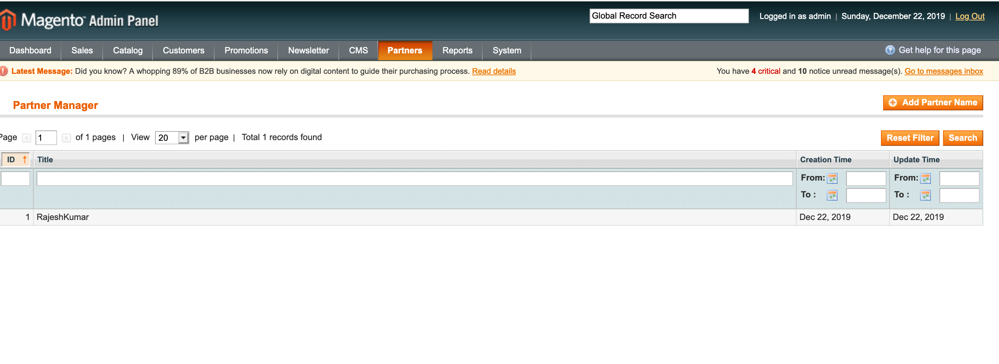
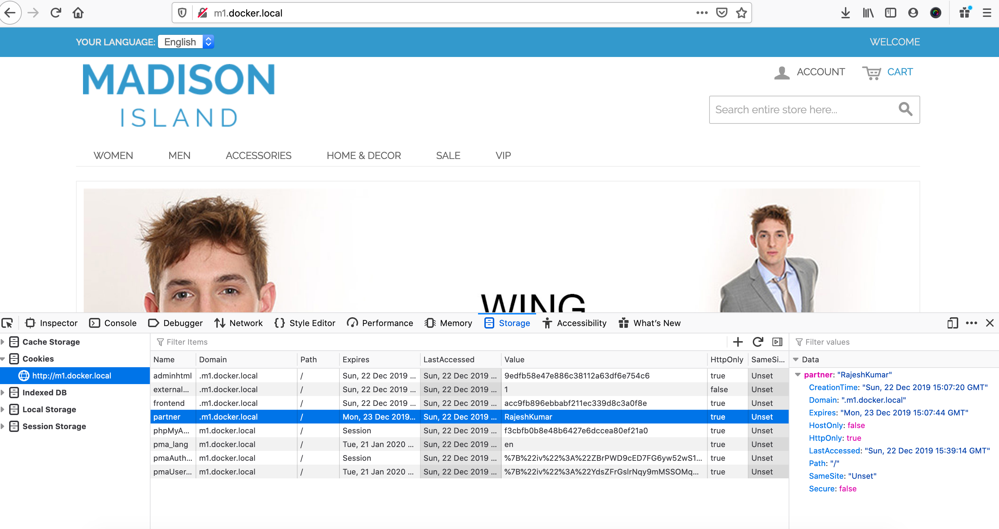
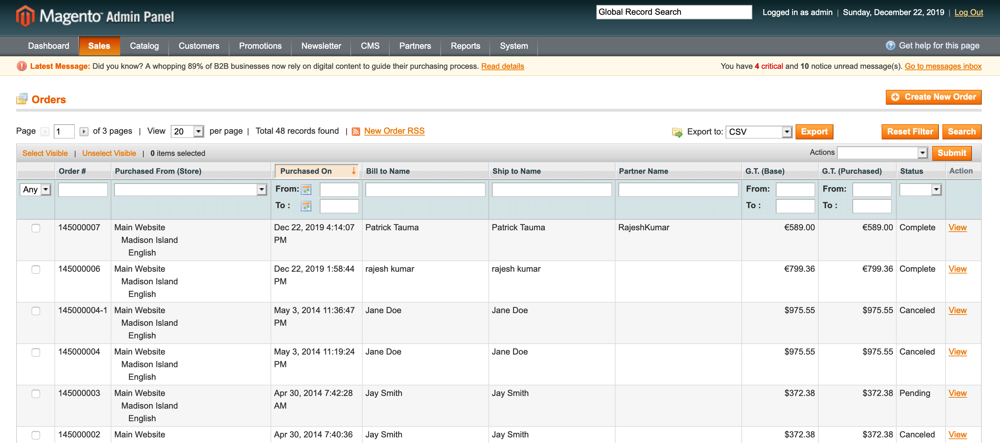
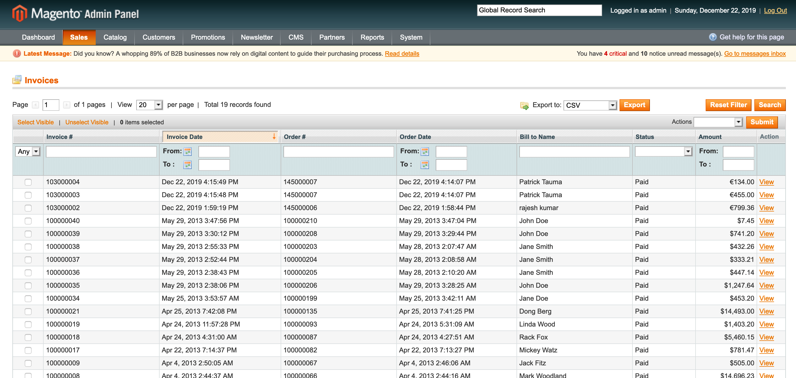
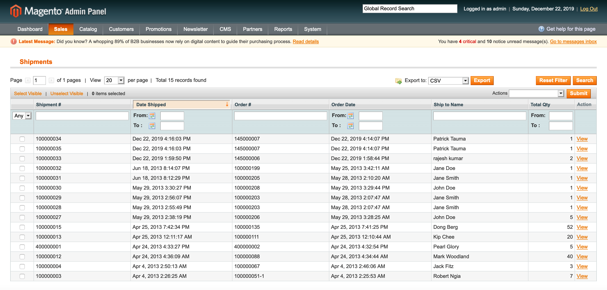

# Magento 1.9 - Partner invoices with Docker Container

This Docker container is build with support to `Nginx`, `PHP 5.6` (built with PHP FPM) and `MySQL 5.7`. It is also shipped with `PHPMyAdmin` and `xDebug`. Additionally, you can enable support for ionCube Loader, uncommenting the right lines at _docker-magento19/php/Dockerfile_.

## How to use this repository

Just clone the files into your project folder. It contains a Magento 1.9.3.4 CE installation, with sample data.

There are three folders:

- docker-magento19 - that is the folder for Docker files
- htdocs - that is the root folder, where website files are copied (I recommend the use of an automatic deploy, probably included in your IDE). Magento source files are here
- project - that is the project folder, linked with htdocs folder with magento files

### Starting the container

Just open your terminal and navigate to docker-magento19 of this project. Type:

`docker-compose up -d`

Docker will build the containers and start them. You must also map the address _127.0.0.1 m1.docker.local_ on your hosts file.

### First access to project site

**Before accessing the Magento site**, you must decide if you want to use the sample data or use a clean install.

If you prefer not use the sample data, just comment this line on _docker-compose-yml_, _project_ node, **rebuild your containers** and proceed to a regular install of Magento, accessing the site.

`- local.xml:/var/www/htdocs/etc/local.xml`

If you prefer to use the sample data, you must import it. On this project you find a base DB, on folder sample-db. To use it, you just import it over magento1 DB, using PHPMyAdmin or your favourite MySQL client.
After that, when you access the project site, you must see a complete RWD theme, with all elements on home page, like banners and products.

### Accessing Magento backend

When using sample data, just navigate to m1.docker.local/admin and access the panel with these credentials:

username: `admin`
password: `a123456`

### Changing project / htdocs files

To see your site live, just open a browser and visit m1.docker.local. That's exactly what you find at folder htdocs and it's automatically updated when you change them on your local machine.

### Seeing logs

All logs are saved locally, on folder docker-magento19/logs. You can control them on your local machine.
Access logs are disabled from nginx config files. If you need them, see docker-magento19/nginx conf files.
To see Magento logs, just open you var/logs and var/report folders, under htdocs.

### Accessing the container terminal

If you need to access the container terminal, use the following commands:

- to see which are the running containers: `docker ps`
- to connect to a container as root: `docker exec -it {container_name} bash`
- to connect to a container as local user (1000): `docker exec -it --user local {container_name} bash`

### Adding a database

Database files are found on docker-magento19/databases and use a specific user, which means no access from the local machine. They are not included on git repository.
If you have some problems starting the MySQL container, try to empty this folder and build the container again.

### Connecting to DB

To create a DB and set user credentials, check docker-magento19/docker-compose.yml file. You find the entries at mysql node.

To connect to a DB from local machine, just use the localhost address (like 127.0.0.1) and the credentials.

To connect to a DB from another container, like from a framework running on php side, use the entry `mysql` as address/server

### Using PHPMyAdmin

This project is shipped with a PHPMyAdmin instance. It is accessible via 8084 port. So, just navigate to `m1.docker.local:8084` and use same credentials informed at docker-compose.yml file.

## Partner invoices

Imagine a web shop build in Magento 1.9, that sells physical items. The items are actually sold by different physical stores, but there is also a main warehouse. 

Any physical store can do their own marketing activities and can send traffic to the site. Based on the partnership contract, when a customer come referred by a physical store, the order will be shared, meaning that the store will ship and invoice half of the products, and the main warehouse will ship and invoice the other half. 

Please follow the below step to check this functionally.

Please go in admin and create the partner name: 
 
the path is : Admin ->Partners - click on Add Partner Name button right side 
 
 
After creating the partner name in the admin. Please come on the home page pass the partner name in the query like this
 http://m1.docker.local/?partner=RajeshKumar 
 
After hitting this URL you will see the cookies saved as below.
  

Now please go and place order. After placing order, you can see the the admin order grid partner name as below

 the path is : Admin->Sales->Orders 
 
You can create Invoices

the path is : the path is : Admin->Sales->Invoices 
  
Also shipments 

the path is : Admin->Sales->Shipments 
 
 